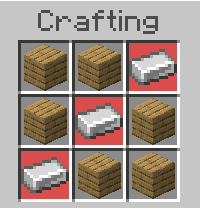
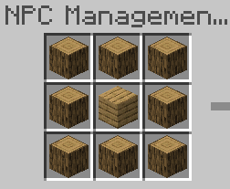
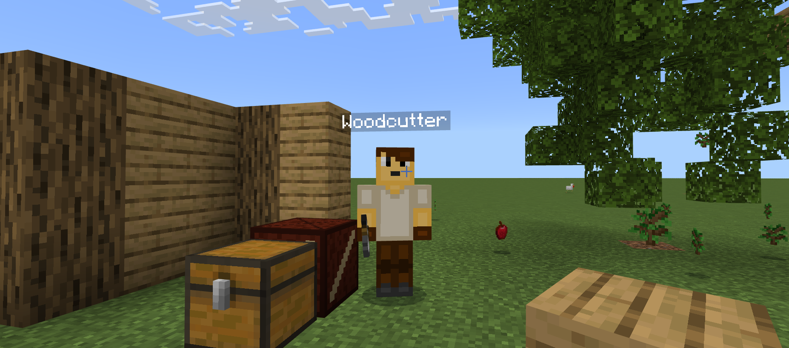

# NPC Pack for Minecraft Bedrock Edition
Pack of NPCs for use in Bedrock Add-Ons.

For use with `@minecraft/server@2.0.0-alpha`

## Using in a Local Minecraft World
Download this repository and verify you have Node and NPM installed into your command-line.
```ps
node --version
```
```ps
npm -v
```

Once both those commands work properly, CD into the root of this project and run the following commands.

```ps
npm i
```
```ps
npx gulp build && npx gulp deploy_localmc
```

You can now enable this behavior pack in your local Minecraft Bedrock Edition games.

## NPCs in Survival
All NPCs in this add-on have their own dedicated spawning blocks. These blocks must be crafted from the **NPC Spawn Table**. You can make this table by crafting the following recipe at any crafting table.



## List of NPCs
These are the NPCs included in this pack so far.
### Woodcutter

The woodcutting NPC uses advanced, custom pathfinding and placement algorithms to cut trees, place logs into a chest, and re-plant trees (including properly replanting dark-oak 4-sapling style trees).

You can right-click the placement-block (Woodcutting Manager block) to configure the woodcutter's options.

To spawn a woodcutter in survival, build the Woodcutter Manager block with the below recipe at the NPC Spawn Table (it can use any logs and planks combination).




